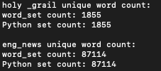
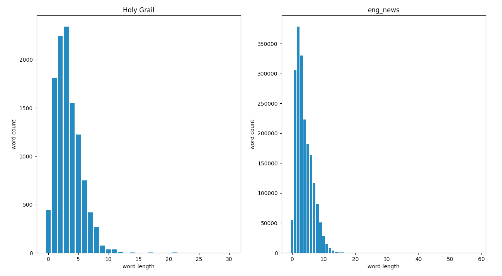
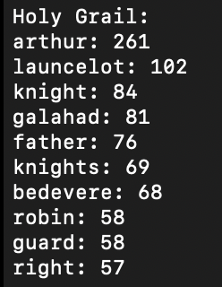
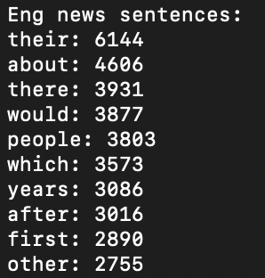
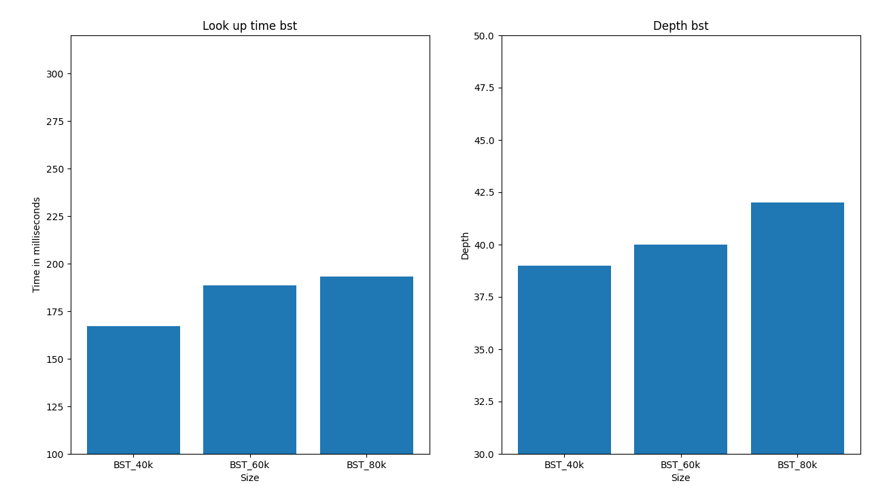
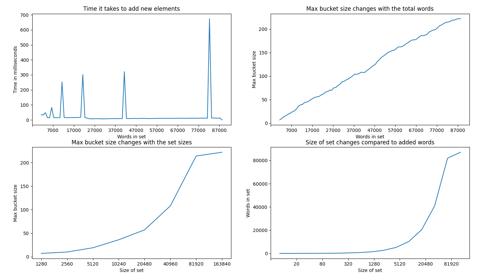

# Mini-project report 
Members: Marcus Johansson, Marcus Thornemo Larsson, Christoffer Malmberg   
Program: Software Technology  
Course: 1DV501 
Date of submission: 2020-10-28

## Introduction  
I detta projektet implementeras datastrukturerna Hash set och Binary search tree. Manuset från filmen Monty Python, The Holy Grail som innehåller cirka 80 000 ord och en andra textfil med meningar ca 100,000 meningar samlade från engelska nyhetstidningar. Den filen innehåller ca 2 miljoner ord. Dessa två filer används för att med vårat implementerat set räkna hur ofta varje unikt ord förekommer. Med vårat Binary Search Tree räkna hur ofta ett ord med en given längd förekommer och med trädet kunna presentera en 10 i topplista med de flest förekommande orden med fler än 4 bokstäver. 

En uppgift i projektet innebär att mäta tiden det tar för det implementerade trädet att kolla upp X antal ord och djupet på trädet. Tiden det tar att lägga till ord i setet mäts också för att se hur processen att lägga till ord i setet motsvarar rehash funktionen. Rehash innebär att setet kopieras och läggs in på nytt i ett nytt dubbelt så stort set. Detta händer när antal ord i setet är lika i antal med storleken på setet.

## Part 1: Divide text into words
- What is your definition of a word?

Vi räknar ord som ord om de innehåller mer än en bokstav, förutom "a" och "i" då dessa räknas som ord.

- How did you implement your word identification? Feel free to present a compact version of your Python code but only the part that divides a text into words. (Not including file IO and other parts not directly related to word identification.) 

Våran metod för att filtrera bort oönskade tecken implementerades så här:
```python
def text_split(text):
	Allowed string = "abcdefghijklmnopqrstuvwxyz ABCDEFGHIJKLMNOPQRSTUVWXYZ\n"
	temp = "".join(filter(allowed.__contains__, text))
    return temp
```
Sedan används metoden nedan för att göra all bokstäver till små bokstäver och filtrera bort alla ensamstående bokstäver förutom "a" och "i".
```python
def to_lower_and_removing_letters(lines):
	temp = [word.lower() for word in lines]
    temp_ = [word for word in temp if len(word) > 1 or (len(word) == 1 and (word == "a" or word == "i")]
    return temp_
```

- Present a word count for the two files 1) ``holy_grail.txt`` (Grail), 2) ``eng_news_100K-sentences.txt`` (news_100k).

	Antal ord i ``holy_grail.txt``: 11216 st

	Antal ord i ``eng_news_100K-sentences.txt`` : 1945997 st

## Part 2: Implementing data structures
- Give a brief presentation of the given requirements:

Kraven som finns på dessa två datastrukturers implementation är följande:

Båda datastukturer ska implementeras på ett ikke klass baserat vis.

- <b>Hash set</b>: Byggs med användning av pythons list() för att lägga in i en bucket där bucket[x] i sin tur har en python list()

<h3>Exempel:</h3>

| ``Bucket``  | bucketlist | 
|:------- |:-----------
| [0]     | ["element", "element"] 
| [1]     | ["element"]        
| [2] 	  |	[]        


- For the hash based word set, present (and explain in words):
 	* Python code for function ``add``, how to compute the hash value, and rehashing.

		```python
		def add(word_set, word):
		global size
		if size == bucket_list_size(word_set):
			rehashing(word_set)
		if not contains(word_set, word):
			key = get_bucket_number(word_set, word)
			word_set[key].append(word)
			size += 1
		```
		``add`` functionen tar in ett ``word_set`` och ett ``word`` som parametetrar. ``global size`` är en global variable som håller på antalet element (ord) som finns i ``word_set``. Då ``size`` är lika stor som bucket_list_size som (antal buckets i ``Bucket``) så körs funktionen ``rehashing(word_set)`` 

		```python
		def rehashing(word_set):
		global size
		set_copy = word_set.copy()
		word_set.clear()
		for i in range(len(set_copy) * 2):
			word_set.append([])
		for key in set_copy:
			for element in key:
				add(word_set, element)
				size -= 1
		```

		``rehashing(word_set)`` kopierar parametern ``word_set`` och tömmer sedan ``word_set`` på element. Längden på ``word_set`` dubblas och orden från kopian läggs sedan in i den nu tömda ``word_set``. ``size`` reduceras med 1 för att kompensera med att den ökas i add funktionen.
	
		För att räkna vilken ``Bucket`` ett ord ska läggas i används metoden ``get_bucket_number(word_set, word)``

		```python
		def get_bucket_number(word_set, word):
			hash = hash_word(word)
			bucket_number = hash % bucket_list_size(word_set)
			return bucket_number
		```

		I den används metoden ``hash_word(word)`` för att räkna ut hash värdet

		```python
		def hash_word(word):
			hash_sum = 0
			for char in range(len(word)):
				hash_sum += ord(word[char]) if char % 2 == 0 else ord(word[char]) * 2
			return hash_sum
		```
		Det som händer i ``hash_word(word)`` är att ascii värdet för varje bokstav i ``word`` summeras och för att gör hash funktionen mer robust multipliceras varannat ascii värde med 2.

 	* Point out and explain any differences from the given results in ``word_set_main.py``

		Skillnaden vi får ifrån det givna resultatet som finns i ``word_set_main.py`` är att orden inte läggs in i samma buckets. Detta beror på att metoden som vi använder oss av för att räkna fram hash värdet skiljer sig ifrån den som genererat det givna resultatet  
 	* What is the max bucket size for the words in the large text files Grail and news_100k?

	 	``max_bucket_size`` för ``holy_grail.txt`` : 13<br>
	 	``max_bucket_size`` för ``eng_news_100K-sentences.txt`` : 222

- For the BST based table, present (and explain in words):
 	* Python code for the two functions ``add`` and ``max_depth``.
	 ```python
	def add(root,key,value):
    if root[0] is not None:
        if root[0] == key:
            root[1] = value
        elif root[0] < key:
            if root[3] is None:
                root[3] = [key, value, None, None]
            else:
                add(root[3], key, value)
        elif root[0] > key:
            if root[2] is None:
                root[2] = [key, value, None, None]
            else:
                add(root[2], key, value)
    else:
        root[0] = key
        root[1] = value
        root[2] = None
        root[3] = None
	
	```
	Funktionen add tar 3 parametrar, root som är den första noden i trädet, en key och ett value. När funktionen kallas kollar funktionen om noden har någon key eller om den är None. Har noden en key kollar funktionen om det är samma key som skickas in som parameter och om det är sant så updateras valuet till den keyn, om det inte är samma key kollar funktionen om keyn som skickades in är större eller mindre (Alfabetisk ordning) än keyn som är sparad i noden. Om den är mindre så kollar vi om noden har en left_child, om den är större kollar vi om noden har en right_child. Om noden inte har en child kommer key och value som skickades in som parametrar att spara i left- eller right_child (beroende på om ordet är större eller mindre) hos noden. Om noden har en child kommer funktionen att kallas på igen men istället för att skicka in den första noden som parameter skickas nodens left- eller right_child in. Funktionen fortsätter att kalla sig själv ända tills den hittar en node som inte har en child, och där kommer en ny child node skappas och key och value sparas i den noden.

	```python
	def max_depth(node):
    if node is None:
        return 0
    else:
        return 1 + max(max_depth(node[2]), max_depth(node[3]))
	```
	max_depth tar en node som parameter, och kollar om den är None. Om det är sant så retunerar den 0. Och om det inte är sant så retunerar den 1 + det största värdet av max_depth för båda nodens barn. Funktionen kallar alltså på sig själv en gång för left_child och en gång för right_child, och gör samma jämförelse igen. Funktionen kommer fortsätta kalla på sig själv så länge noderna som skickas in har en child. Tillslut kommer noderna att nå botten (en node som är None) och då retunerar funktionen 0 istället för att kalla på sig själv, detta leder till att alla ettor från varje steg i trädet neråt adderas och jämförs. Varje jämförelse kommer skicka tillbaka det största värdet alltså sidan som är djupast. När funktionen sen är hoppat tillbaka alla steg kommer vi få ut det största värdet utav max_depthnm(node[2]) (left_child) och max_depth(node[3]) (right_child) som då kommer vara trädets maximala djup.

 	* Point out and explain any differences from the given results in ``table_main.py``.

	 Efter vi implementerat table.py och kör table_main.py så får vi exakt samma output som det förväntade resultatet i table_main.py

 	* What is the max depth when adding words (as both key and value) from the large text files Grail and news_100k?

	Djupet på trädet blir runt 38-43 när vi kör eng_news_100k. Trädet har inte samma värde djupet varje gång på grund av att ett set skickas in i trädet i part_four_main, set är inte sorterade i ordning och därför skickas orden in olika ordning varje gång vi kör koden.

## Part 3: Word related exercises
For each subtask: 1) A brief presentation of the task, 2) How did you solve it (in words), and 3) Results.<br>
	<h3>3.1</h3> I denna deluppgift ska antal unika ord räknas i de båda text filerna. Denna uppgift löste vi genom att först använda ``set`` i python för att sedan kunna jämföra det resultatet med vårat eget ``word_set``. I ``word_set.py`` finns metoden ``count(word_set)`` som med parametern word_set returnar dess size som i sin tur är antal unika ord i det word_setet. Detta gav följande resultat:


<div align="center">
	
</div>

<h3>3.2</h3> I denna deluppgift ska orden i de båda texterna räknas med hänsyn till ordens längd. Så alla ord med längd 1 räknas och så vidare till vi har kommit till de orden som håller på den längsta ord längden. För att hitta de längsta orden i de båda textfilerna användes följande metod:<br>

```python
	def longest_words_bst(lst):
		longest = 0
		for x in lst:
    		if len(x[0]) > longest:
        		longest = len(x[0])
		return longest
```

I ``holy_grail.txt`` är det längsta ordet 31 tecken långt och i ``eng_news_100K-sentences.txt`` är längsta ordet 59 tecken långt.<br>
I figuren nedan plottas resultatet i ett histogram:<br>

<div align="center">
	
</div>


<h3>3.3</h3>I denna deluppgift ska topp-tio mest frekventa ord längre än fyra tecken presenteras. För att lösa denna uppgift körs följande kod:

```python
eng_filtered = filter(lambda x: len(x[0]) > 4, bst_lst_eng)
holy_filtered = filter(lambda x: len(x[0]) > 4, bst_lst_holy)
filtered_eng_list = list(eng_filtered)
filtered_holy_list = list(holy_filtered)
freq_bst_eng = [word for word in sorted(filtered_eng_list, key=lambda x:x[1], reverse=True)]
freq_bst_holy = [word for word in sorted(filtered_holy_list, key=lambda x:x[1], reverse=True)]
```
Ord <= 4 soteras bort och sorteras sedan i ordningen störst ``value`` först. När detta är gjort så kan följande kod köras:

```python
print("\nHoly Grail:")
for word in freq_bst_holy[:10]:
    print(f"{word[0]}: {word[1]}")
print("\nEng news sentences:")
for word in freq_bst_eng[:10]:
    print(f"{word[0]}: {word[1]}")
```

Resultatet blir följande:


<div align="center">
	
	
</div>


## Part 4: Measuring time
For each subtask:
* Describe in words and a minimum of Python code how you solved the problems.

4.1 - Mäta tiden det tar att att hämta 20000 unika ord.

I detta experiment används tre stycken binärasökträd, (BST), med olika storlek, 40000, 60000 och 80000 ord. Utav dessa ord kommer 20000 ord slumpmässigt att hämtas ur var och ett av träden där tiden tas för att jämföra vilket av träden som det går att hämta 20000 ord snabbast från.

I praktiken bör det träd som är störst och har flest ord att ta längst tid att hämta ifrån men i värsta fall kan de 20000 slumpmässiga orden att vara de 20000 första orden i de träd som är störst och vara de 20000 sista i det träd som är minst. Då detta "worst case" finns görs denna mätning 10 gånger och sedan tars ett snitt för var och ett av träden. 

Ur texten ``eng_news_100k-sentences_list.txt`` plockas alla unika ord ut och därefter läggs de 40000, 60000 och 80000 första orden i listan in i var sitt träd, BST_40000, BST_60000 och BST_80000. För att göra detta används ``text_splitter.py``, där alla ord läggs till i en lista. Därefter används funktionen ``count_words(lst_words)`` som lägger till alla unika ord i en dictionary och för varje gång ett ord återkommer ökar värdet på detta ord med ett. 

```python
def count_words(lst_words):
    dict_ = {}
    for word in lst_words:
        dict_[word] = dict_[word] + 1 if word in dict_ else 1

    return dict_
```

Ur funktionen ``get_random_words(lst, range_)``, där listan med unika ord skickas in samt hur många av de första orden som ska användas för att slumpa en ny lista med ord som ska hämtas i experiementet.

```python
def get_random_words(lst,range_):
    rand_words = lst[0:range_]
    random.shuffle(rand_words)
    return rand_words[0:20000]
```

Med hjälp av en for-loop som körs 10 gånger görs tidtagningar för varje träd och sparas i en egen lista, ``bts_times``. Efter varje tidtagning och innan en ny omgång i for-loopen kollas även max djupet för varje träd, med funktionen ``max_depth(node)``, som även de sparas i en egen lista ``bts_depths``.

Varje gång en ny omgång i loopen körs tars nya slumpmässig ord ut och nya tidtagningar och max djup mäts. Nedan är de första raderna i for-loopen där den fortsätter med två till mätningar som ser likadana ut förutom att träden är större med fler ord.

```python
for x in range(10):
    rand_words = get_random_words(list_dict, 40000)
    bst_start = time.time()
    for x in rand_words:
        tbl.get(root_1, x[0])
    time_elapsed = time.time() - bst_start
    bst_times[0] += time_elapsed
    bst_depths[0] += tbl.max_depth(root_1)
    ...
```

4.2 - Lägga till 1000 unika ord i hashset som är olika stora.

När detta test ska genomföras börjar vi likt i 4.1, där texten ``eng_news_100k-sentences_list.txt`` först delas upp till en lista med ord med hjälp av ``text_splitter.py`` och där efter görs denna lista om till ett set med hjälp av pythons egna funktion ```set()```. Detta för att vi vill endast testa att lägga till unika ord. Med hjälp av en while-funktion adderas 1000 unika ord i x antal omgångar tills alla ord är inlagda i hashsetet, ``word_set.py``.

För varje tusental ord som läggs in tas tiden det tar att lägga till dessa ord i hashsetet. Samma hashset används helatiden så för varje tusental som läggs till är setet större.

I denna while-loop sparars olika värden ner i fyra olika dictionarys, vi tar mätningsdata på tiden det tar att lägga till 1000 ord, hur stor den största bucket är jämfört med storlek på setet samt antalet ord i setet. Det finns även med en mätning som visar hur setets stolek ökar vid varje rehash.

```python
while rounds < 100:
    start_time = time.time()
    for words in word_set_list[range_a:range_b]:
        ws.add(hash_word_set, words)
        if ws.bucket_list_size(hash_word_set) == ws.count(hash_word_set):
            set_size_vs_word_count[str(ws.bucket_list_size(hash_word_set))] = ws.count(hash_word_set)
    time_elapsed = time.time() - start_time
    ...
```

* Present and explain results and figures. Are the results as expected?

4.1 - Resultat - Mäta tiden det tar att att hämta 20000 unika ord.

I den vänstra grafen ser vi att tiden det tar att hämta ett ord ökar när storleken ökar i de olika BST och i den högra ser vi djupet för de tre BST. Ökningen i tid kommer vara olika för varje gång men kör testet då orden som ska hämtas är slumpmässiga vilket betyder att i vissa fall kan de minsta trädet ta längre tid att hämta jämfört med det största.

För att få ett bättre resultat gjorde vi detta 10 gånger, men kan såklart köras fler gånger och man kan ha fler träd med olika storlek för att få ett bättre resultat. 

<div style="text-align:center">
	
</div>


4.2 - Resultat - Lägga till 1000 unika ord i hashset som är olika stora.

Första grafen visar att addera något i ett hashset ska gå lika snabbt oberoende på hur många ord/objekt som finns i listan. Det som tar tid och dom topparna vi ser är när hashsetet är fullt och behöver göra en rehash och utöka platserna. Detta tar längre och längre tid när antalet ord/objekt ökar.

Andra grafen på övre raden visar hur många ord som finns i den bucket som är störst. Där ser vi att den ökar då sannorlikheten att ett ord ska få samma hashning ökar då ord och setet ökar i storlek. Det får så klart att få ner detta med en bättre hashning av orden.

Första grafen nertill visar även den hur max bucket size ökar då storleken på setet ökar. Den sista grafen är till för att man ska se hur storleken ökar efter varje rehashning.

<div style="text-align:center">
	
</div>


## Project conclusions and lessons learned
We separate technical issues from project related issues.
### Technical issues 
- What were the major technical challanges as you see it? What parts were the hardest and most time consuming.

När vi skulle göra hashningen i hashsetet använde vi oss bara att summan av alla bokstävers ASCII-kod i ordet först vilket gjorde att vi inte fick samma resultat som förväntades i ``word_set_main.py``. Detta gjorde att vi impkementerade en teknik för hashsets som kallas ``Linear probing``. Denna teknik gjorde att vi aldrig fick större buckets än 2 men tiden att lägga till ord och ta bort ord blev betydligt längre så vi skrotadde den implementeringen och åter gick till att bara multiplicera varannan bokstavs ascii värde i ordet med 2.  

- What lessons have you learned? What should you have done differently if you now were facing a similar problem.

Vi lärde oss att de finns en del olika tekniker för att göra en hashmetod mer effektiv.

- How could the results be improved if you were given a bit more time to complete the task.

Om vi hade haft mer tid så hade vi implementerat någon av dessa tekniker för att om hashingen i hashset görs bättre få det en bättre spridning och en lägre max bucket size. Detta gör att setet blir lite snabbare. 

I part 4 skulle man kunna göra bättre mätningar, t ex göra fler mätningar med fler BST, då man hämtar slumpmässiga ord kan mätningarna bli dåliga och de största trädet gå snabbast jämfört med de minsta. I detta expriment/test skulle man kunna försöka hitta ett annat sätt än att använda sig at slumpmässiga ord, ex slumpmässigt med någon seedning.

För testet med hashsetet kan man med samma test som vi gjort, göra det i flera gånger med flera olika hashset och sedan ta ett snitt på de olika mätningarna.

### Project issues
- Describe how your team organized the work. How did you communicate? How often did you communicate?

Vi delade upp uppgifterna som det föreslogs av läraren. Man tar en del var när man är klar tar man en ny eller hjälper till med en uppgift om någon fastnat. Vi kommunicerade via discord då Christoffer befinner sig i Skåne, Marcus och Marcus träffades även i skolan. Vi träffades ca 8-16h/v.

- For each individual team member: 
* Describe which parts (or subtasks) of the project they were responsible for. Consider writing the report as a separate task. Try to identify main contributors and co-contributors.
 	
Marcus Johansson gjorde ``text_split.py``, vi diskuterade även om vilka ord som skulle användas tillsammans. Christoffer implementerade ``table.py``, Marcus T-L började med ``word_set.py`` och Marcus J kom in och hjälpte till där då vi hade problem med hashningen.

Part 3 gjorde Christoffer och Marcus J.

Part 4 gjorde Christoffer och Marcus T-L.

I rapporten skrev Marcus J om Part 1, 2(hashset) och 3. Christoffer om BST. Marcus T-L skrev Part 4 samt lite i Part 5 angående förbättringar i Part 4.
 	

 - What lessons have you learned? What should you have done differently if you now were facing a similar project.

Alla i gruppen har jobbat med datastrukturerna som implementars i detta projekt ifrån tidigare kurser. Så det var inte mycket problem med implementationen, men alla tyckte det var nyttigt att friska upp minnet. Något vi har lärt oss och tar med från denna kurs är varför man inte implementerar datastrukturer i python.


